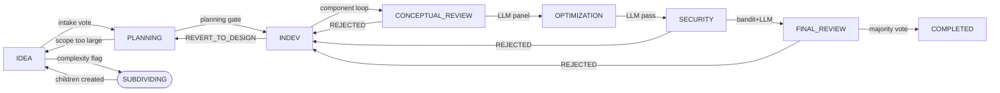
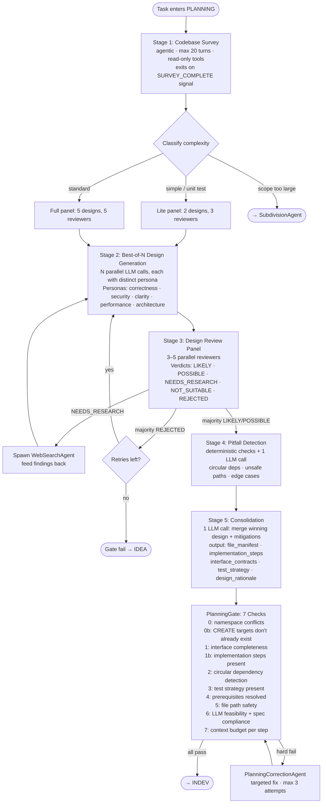

# TheMaestro — Architecture Reference

> **Living document.** Reflects the system as built and deployed. Update when behavior changes. Last revised: 2026-05-03.

---

## 1. What TheMaestro Is

TheMaestro is an **agentic software factory**: a Kanban board whose cards are not tracked by humans — they are *executed* by LLMs. A user describes what they want on an IDEA card. The system drives a fleet of locally-hosted language models through a structured pipeline — Design → Implement → Test → Review → Accept — using a DAG-aware scheduler, worktree-isolated git branches, and a multi-stage review chain. Human oversight is the exception, not the constant.

The core design principle is **irreversibility prevention**: every agent action is either reversible (archive instead of delete, branch instead of commit-to-main) or gated (planning gate, review panel, intake vote). A bad run produces a rejected card and a demotion record. It cannot corrupt the project, poison future runs, or overwrite work from parallel tasks.

---

## 2. System Topology

```
┌─────────────────────────────────────────────────────────────────────┐
│                        HUMAN OPERATOR                               │
│              Kanban Board  ·  Stage Journal  ·  Diagnostics         │
└──────────────────────────────┬──────────────────────────────────────┘
                               │  HTTP (FastAPI)
┌──────────────────────────────▼──────────────────────────────────────┐
│                     TheMaestro Server (FastAPI)                     │
│  ┌──────────────┐  ┌─────────────────┐  ┌────────────────────────┐ │
│  │  REST API     │  │   Scheduler     │  │   MCP Server           │ │
│  │  /api/tasks   │  │   (5-sec tick)  │  │   (maestro tools)      │ │
│  │  /api/agent   │  │   DAGResolver   │  │   monitor·diagnose·etc │ │
│  │  /api/llms    │  │   CapacityModel │  │                        │ │
│  └──────────────┘  └────────┬────────┘  └────────────────────────┘ │
│                             │ dispatch                               │
│  ┌──────────────────────────▼────────────────────────────────────┐  │
│  │                     Agent System                              │  │
│  │  MaestroLoop · PlanningPipeline · SubdivisionAgent           │  │
│  │  IntakeVoter · ConceptualReview · SecurityReview             │  │
│  │  OptimizationPipeline · FinalReviewPipeline · PIPResolution   │  │
│  └──────────────────────────┬────────────────────────────────────┘  │
│                             │  OpenAI-compatible HTTP                │
└─────────────────────────────┼───────────────────────────────────────┘
                              │
        ┌─────────────────────▼──────────────────────┐
        │          Compute Resource Layer             │
        │                                             │
        │  ┌──────────────┐   ┌──────────────┐       │
        │  │  Compute     │   │  Compute     │  ...  │
        │  │  Node A      │   │  Node B      │       │
        │  │  max 5 sess  │   │  max 5 sess  │       │
        │  │  max 2 models│   │  max 2 models│       │
        │  │  ┌──┐ ┌──┐   │   │  ┌──┐ ┌──┐  │       │
        │  │  │L1│ │L2│   │   │  │L3│ │L4│  │       │
        │  │  └──┘ └──┘   │   │  └──┘ └──┘  │       │
        │  └──────────────┘   └─────────────┘       │
        │                                             │
        │  L1–L4: LLM Endpoints (base_url, model,    │
        │         max_context, parallel_sessions)     │
        └─────────────────────────────────────────────┘
                              │
        ┌─────────────────────▼──────────────────────┐
        │           SQLite Database                   │
        │           data/kanban.db                    │
        └─────────────────────────────────────────────┘
```

---

## 3. The Pipeline

Cards move left-to-right through nine stages. Each transition is gated.



### Stage Summary

| Stage | Agent | Gate | Demotes To |
|---|---|---|---|
| **IDEA** | IntakePipeline (vote panel) | 4-stage intake vote | — (stays IDEA on reject, retries) |
| **PLANNING** | PlanningPipeline + PlanningGate | 7-check deterministic + 1 LLM feasibility | IDEA (scope too large → subdivide) |
| **INDEV** | DevOrchestrator → MaestroLoop (per component) | All components pass + tests green | PLANNING (REVERT_TO_DESIGN) |
| **CONCEPTUAL_REVIEW** | ConceptualReviewPipeline | LLM panel majority | INDEV |
| **OPTIMIZATION** | OptimizationPipeline | LLM pass | INDEV (if regressions) |
| **SECURITY** | SecurityPipeline | Bandit + pip-audit + semgrep + LLM | INDEV |
| **FINAL_REVIEW** | FinalReviewPipeline | LIKELY/POSSIBLE majority | INDEV |
| **COMPLETED** | — | Human merge to main | — |

### Demotion & PIPs

Every demotion writes a record to `demotion_history` (JSON array on the task row) and increments `demotion_count`. On re-dispatch, the agent loop injects all prior demotion records as **Performance Improvement Plans** — hard requirements the agent must satisfy before submitting. A card that has been demoted twice must explicitly address both failure reasons. PIPs are injected before the agent's first turn; they cannot be ignored.

---

## 4. Compute Resource Model

This is the capacity layer that governs how many agents run in parallel, on which hardware, against which models.

### Entities

```
compute_nodes
  └── llms (one-to-many via compute_node_id)
        └── budget_entries (one-to-many)
              └── expenses
```

**Compute Node** (`compute_nodes` table): represents a physical or virtual machine running inference. Configuration:

| Field | Meaning |
|---|---|
| `name` | Human label (e.g. "RTX-4090-Box", "Cloud-A100") |
| `max_loaded_models` | How many distinct model checkpoints can be in VRAM simultaneously |
| `max_parallel_sessions` | Hard ceiling on concurrent agent sessions across all LLMs on this node |

**LLM Endpoint** (`llms` table): represents a single running model server (llama.cpp, vLLM, Ollama, etc.) on a node.

| Field | Meaning |
|---|---|
| `address` + `port` | Where to reach the OpenAI-compatible `/v1/chat/completions` endpoint |
| `model` | Model name passed in requests (e.g. `"qwen2.5-coder-72b"`) |
| `max_context` | Context window in tokens (e.g. 100,000) |
| `parallel_sessions` | Max concurrent sessions against this specific endpoint |
| `compute_node_id` | FK to compute_nodes — groups endpoints by machine |
| `cost_per_million_prompt_tokens` | For budget tracking (0 for local) |
| `cost_per_million_completion_tokens` | For budget tracking (0 for local) |

### Example: Three-Node Cluster

```
Compute Node "Box-A"   (max_loaded_models=2, max_parallel_sessions=5)
  ├── LLM: qwen2.5-coder-72b  port 8008  max_context=100k  parallel_sessions=3
  └── LLM: qwen2.5-72b-inst   port 8009  max_context=100k  parallel_sessions=2
                                                     subtotal: 5 slots, 2 models

Compute Node "Box-B"   (max_loaded_models=2, max_parallel_sessions=5)
  ├── LLM: qwen2.5-coder-72b  port 8010  max_context=100k  parallel_sessions=3
  └── LLM: qwen2.5-72b-inst   port 8011  max_context=100k  parallel_sessions=2
                                                     subtotal: 5 slots, 2 models

Compute Node "Box-C"   (max_loaded_models=1, max_parallel_sessions=5)
  └── LLM: deepseek-r1-70b    port 8012  max_context=100k  parallel_sessions=5
                                                     subtotal: 5 slots, 1 model

Total capacity: 15 parallel agent sessions across 3 nodes, all at 100k context
```

### Capacity Enforcement

The scheduler enforces **three nested caps** at every tick:

1. **Per-LLM cap**: sessions against one endpoint ≤ `llm.parallel_sessions`
2. **Per-node model cap**: distinct models loaded on one node ≤ `node.max_loaded_models`
3. **Per-node session cap**: total active sessions on one node ≤ `node.max_parallel_sessions`

Caps are tracked in tick-local counters that are updated atomically as dispatches are reserved within a single scheduler tick. Subsequent dispatches within the same tick see the already-reserved slots, preventing double-booking.

Additionally: a **budget pre-flight check** estimates worst-case token cost for the dispatch (`prompt_context_window + completion_max_tokens_per_turn`) and rejects the dispatch if the task's budget would be exceeded.

### Current Constraint: One-LLM-at-a-Time

With llama.cpp, only one model can be resident in VRAM at a time. The scheduler enforces this by treating the first model dispatched in a tick as the "pinned" model for that tick and skipping any task that would require a different model. When all sessions of the pinned model drain, the next tick can pin a different model.

This constraint is architectural to llama.cpp, not to TheMaestro's scheduler. Switching to vLLM, TGI, or multi-instance Ollama removes it entirely — the scheduler's capacity model already handles multi-model parallelism correctly.

---

## 5. The Scheduler

**Location:** `app/agent/scheduler.py`  
**Tick interval:** 5 seconds (configurable in `maestro.ini [scheduler] tick_interval`)

### Tick Lifecycle

```
Every 5 seconds:
  1. Reload LLM/node capacity state from DB
  2. Reset tick-local reservation counters
  3. DAGResolver.get_ready_tasks() → topological sort → candidate list
  4. Filter: skip tasks in cooldown, tasks with active pip_resolution_jobs,
             tasks already running, tasks exceeding budget
  5. For each candidate (in DAG order):
       a. Select LLM: task.llm_id > project.llm_id > least-loaded available
       b. Check capacity: per-LLM + per-node model cap + per-node session cap
       c. Reserve tick-local slots
       d. dispatch_task(task, llm) → spawns async agent coroutine
  6. Rescue orphaned jobs: reset stuck 'running' file-summary / research jobs to 'pending'
  7. Expire hung planning sessions beyond PLANNING_SESSION_TIMEOUT_MINUTES
  8. Prune orphaned git worktrees
```

### DAG Readiness

`DAGResolver` implements Kahn's topological sort. A task is **ready** when:
- `type` is in `dispatchable_types` (configurable; default: all pipeline stages)
- `is_active = True`
- All task IDs in `prerequisites` have `type` in `{completed, cancelled, final_review}` (via `is_effectively_done()`)
- For Big Idea parents: ready only after all child tasks are effectively done
- Not currently in `_active_sessions`
- Not in cooldown (`failed` within 60s, `rejected` within 300s, project-level throttle within 300s)

### Cooldowns

| Trigger | Cooldown |
|---|---|
| Tool/loop failure | 60 s |
| Intake/planning rejection | 300 s |
| Project-level repeated failure | 300 s |

---

## 6. Agent System

Each agent is an async Python class that drives a single LLM in a turn-based loop. They share the same `LLMClient` and `dispatch_tool()` infrastructure but differ in system prompt, tool access, turn limits, and termination conditions.

### Agent Registry

| Agent | Class | File | Role |
|---|---|---|---|
| **MaestroLoop** | `MaestroLoop` | `loop.py` | Primary implementation agent. Drives INDEV component execution. |
| **PlanningPipeline** | `PlanningPipeline` | `planning.py` | 5-stage design pipeline for PLANNING stage. |
| **PlanningGate** | `PlanningGate` | `planning_gate.py` | 7-check structural + LLM validation of planning results. |
| **PlanningCorrectionAgent** | `PlanningCorrectionAgent` | `planning_correction.py` | Targeted correction when gate fails; max 3 attempts. |
| **SubdivisionAgent** | `SubdivisionAgent` | `subdivide.py` | Decomposes oversized IDEA cards into child tasks with prerequisites. |
| **IntakePipeline** | `IntakePipeline` | `intake.py` | IDEA → PLANNING gate: 4-stage LLM vote panel. |
| **ConceptualReviewPipeline** | `ConceptualReviewPipeline` | `conceptual_review.py` | Post-INDEV design quality review. |
| **OptimizationPipeline** | `OptimizationPipeline` | `optimization.py` | Performance improvement pass. |
| **SecurityPipeline** | `SecurityPipeline` | `security_review.py` | Static analysis + LLM security review. |
| **FinalReviewPipeline** | `FinalReviewPipeline` | `final_review.py` | Final multi-reviewer acceptance vote. |
| **DevOrchestrator** | `DevOrchestrator` | `dev_orchestrator.py` | Coordinates component execution order; manages batches; runs test-fix loop. |
| **WebSearchAgent** | `WebSearchAgent` | `research.py` | Search + fetch + synthesize research questions. Dispatched async. |
| **FileSummaryAgent** | `FileSummaryAgent` | `file_summary_agent.py` | Background file summarization for project context cache. |
| **PIPResolutionAgent** | `PIPResolutionAgent` | `pip_resolution.py` | Resolves Performance Improvement Plans post-demotion. |
| **DreamerAgent** | `DreamerAgent` | `dreamer.py` | Survey + orientation agent for project understanding. |

### MaestroLoop Lifecycle

```
init:
  build_initial_context(task, project, architecture_cards, pip_history)
  checkout maestro/task-{id} branch in worktree

turn loop (max 100 turns):
  [1] send messages → LLM → response
  [2] if no tool call: inject "please use a tool" nudge (max 2 consecutive)
  [3] dispatch_tool(tool_call) → result
  [4] if tool fails: increment consecutive_errors
      if consecutive_errors >= 3: emit REVERT_TO_DESIGN, stop
  [5] if submit_work(signal=...): parse signal, stop loop
  [6] if context > 95%: emit MAX_CONTEXT signal, stop

on ACCEPTED:  record files_changed, write component result, git commit
on REVERT:    record failure reason, leave branch as-is (audit trail)
on MAX_TURNS: record as MAX_TURNS status, treat as soft failure

always:
  deregister session, release LLM capacity slot
```

### Tool Access by Pipeline Stage

Tool access is controlled by `build_tool_schemas(allowed_names)` in `config.py`. Each stage receives only the tools appropriate to its role:

| Stage | Tools Available |
|---|---|
| **Survey (planning)** | read_file, list_directory, find_files, find_in_files, read_git_log, read_git_show, get_project_summary, get_directory_summary, get_module_summary, list_scope_summaries |
| **INDEV (MaestroLoop)** | All file I/O, all git tools, all shell tools, spawn_research_agent, web_search, get/write task tools, read_last_output |
| **Security** | read_file, find_files, find_in_files, run_bandit, run_pip_audit, run_semgrep, run_npm_audit, read_git_diff |
| **Optimization** | read_file, write_file, patch_file, run_pytest, run_mypy, run_ruff, run_black_check, write_benchmark |
| **Test-fix loop** | read_file, write_file, append_file, find_files, find_in_files, list_directory, read_last_output |
| **Subdivision** | read_file, list_directory, find_files, find_in_files, write_arch_doc, write_mermaid, write_interface_contract, spawn_research_agent, web_search |

---

## 7. Planning Pipeline (Deep Dive)

The most complex pipeline. Produces a structured `planning_result` that gates all of INDEV.



### Spec Constraint Extraction

If the task description contains binding constraints ("must not use recursion", "naive implementation only", "no external libraries"), the planning pipeline extracts them and injects as `*** SPEC COMPLIANCE — BINDING CONSTRAINTS ***` into both the design generation and gate feasibility prompts. The gate's LLM check reads only `file_manifest` and `implementation_steps` (not rationale text) to detect whether the implementation plan violates any constraint.

---

## 8. Development Orchestrator

**Location:** `app/agent/dev_orchestrator.py`

The orchestrator translates a `planning_result` into a sequenced, parallelized series of component executions.

### Batch Execution Model

```
planning_result.implementation_steps (ordered list)
        │
        ▼
  _group_by_order()  →  batch 1: [step order=1a, 1b, 1c]
                         batch 2: [step order=2a, 2b]
                         batch 3: [step order=3a]
        │
        ▼
  _build_batches()   →  within each batch: scan file_claims
                         if two components claim same file: defer one to next batch
        │
        ▼
  asyncio.gather()   →  up to max_parallel=5 MaestroLoop instances
  (semaphore-gated)       each component runs in same worktree, same branch
        │
        ▼
  on batch complete: git commit (all components in batch in one commit)
        │
        ▼
  run_full_test_suite()
        │
        ├── PASS → emit ACCEPTED
        └── FAIL → test_fix_loop (max 3 attempts × 20 turns)
                        ├── PASS → emit ACCEPTED
                        └── FAIL → emit REVERT_TO_DESIGN
```

### Component Result Persistence

Every component execution writes a row to `component_results`:

| Field | Description |
|---|---|
| `component_name` | Name from implementation_steps |
| `step_order` | Batch order number |
| `status` | done · failed · error |
| `turns_used` | Agent turns consumed |
| `files_changed` | List of modified file paths |
| `error_detail` | First 500 chars of error if failed |
| `dev_run_number` | Incremented per orchestrator invocation |

---

## 9. Git & Worktree Isolation

Each task executes in a dedicated git worktree. Agents never touch the main working tree.

```
project root/
├── .git/                          ← shared object store
├── .maestro-worktrees/
│   ├── task-1746000000.123/       ← worktree for task A
│   │   └── (full checkout of maestro/task-A branch)
│   ├── task-1746000001.456/       ← worktree for task B
│   │   └── (full checkout of maestro/task-B branch)
│   └── ...
├── src/                           ← main working tree (human work)
└── ...
```

### Worktree Lifecycle

1. **Setup** (`setup_task_worktree`): creates worktree + branch `maestro/task-{id}`; appends `/.maestro-worktrees/` to `.gitignore` (lock-protected for concurrent creation)
2. **Execution**: all tool calls (`read_file`, `write_file`, `run_pytest`, etc.) resolve paths relative to the worktree root via `_task_git_cwd` ContextVar — a Python async context variable that is per-coroutine, not global
3. **Teardown** (`teardown_task_worktree`): runs in `finally` block — always executes. Calls `git worktree remove --force` then `git worktree prune`
4. **Crash recovery**: orphaned worktrees (from process kills) are pruned by the scheduler on startup

### Branch Safety Rails

- `write_git_checkout`: only permits `maestro/*`, `main`, `master` — hard-coded, not configurable
- `write_git_branch`: requires `maestro/task-` prefix
- TheMaestro's own repo (`D:\workspace\TheMaestro`) is explicitly blocked from all git operations by `_is_inside_maestro_repo()` — agents working on other projects cannot accidentally git-op the harness itself

### Cross-Task Branch Reads

An agent can read any branch via `read_git_show(ref, path)` where `ref` is a valid git ref (alphanumeric, `-_./~^@`). This is intentional: agents can inspect sibling task branches to coordinate on pending changes. See PRD §FS-2.1 for the pending-change awareness injection that tells agents *when* and *how* to use this capability.

---

## 10. Safety Architecture

Defense in depth: five independent layers. Failure of any one layer does not compromise the others.

```
Layer 1: Tool Constraints
  • _assert_safe_path(): no .git, no .archive reads outside project
  • _assert_safe_write_path(): writes confined to project root, blocked from
    venv / node_modules / __pycache__ / .git / gitignored paths
  • archive_file(): moves to .archive/ — no hard deletes anywhere in the system
  • Named shell tools: one-operation-per-tool (run_pytest, run_mypy, etc.)
    — no raw shell command execution for most pipeline stages
  • Binary file detection: refuses text read/write on binary files

Layer 2: Loop Circuit Breakers
  • MAX_TURNS = 100: terminates runaway loops
  • consecutive_errors >= 3: emits REVERT_TO_DESIGN, halts immediately
  • Context saturation: warnings at 50%/75%/90%, hard stop at 95%
  • External stop: POST /api/agent/stop/{task_id} requests graceful shutdown

Layer 3: Git Isolation
  • Worktree per task: agent corruption cannot reach main working tree
  • Branch prefix enforcement: maestro/task-* only
  • TheMaestro repo self-protection: _is_inside_maestro_repo() block

Layer 4: Planning Gate (structural review before any code is written)
  • Interface completeness: all consumes resolve to provides
  • Circular dependency detection: deterministic graph cycle check
  • Spec compliance: LLM reads only implementation fields, not rationale
  • File safety: all paths validated against safe-write rules
  • Context budget: each step must fit within max_context × 0.8

Layer 5: Review Chain (multi-stage acceptance before merge)
  • ConceptualReview → Optimization → Security → FinalReview
  • Each stage: LLM vote panel with justifications recorded in Stage Journal
  • Demotion with PIP on failure: next attempt must address recorded failures
  • Human merge required: COMPLETED ≠ merged; a human clicks the merge button
```

---

## 11. Data Layer

**Database:** SQLite at `data/kanban.db`  
**Migration engine:** `app/migrations/runner.py` — standalone sqlite3, no SQLAlchemy dependency  
**Migration files:** `app/migrations/versions/NNNN_description.py`, each with `up(conn)`, `down(conn)`, `description`

### Core Tables (abbreviated)

| Table | Purpose | Key Columns |
|---|---|---|
| `tasks` | Every card in the system | id, title, type, project_id, prerequisites (JSON), parent_task_id, demotion_count, demotion_history, is_active, map_x/y |
| `projects` | Project namespaces | name, path, llm_id, budget_id |
| `llms` | LLM endpoints | address, port, model, max_context, parallel_sessions, compute_node_id, cost_per_M_tokens |
| `compute_nodes` | Inference machines | name, max_parallel_sessions, max_loaded_models |
| `budgets` | Spending limits | name, dollar_amount (-1 = unlimited) |
| `budget_entries` | One row per LLM call | task_id, llm_id, prompt_data, response_data, prompt_cost, generation_cost |
| `expenses` | Aggregated cost per call | prompt_tokens, completion_tokens, cost_microcents (prompt + completion separately) |
| `planning_results` | Structured plans | task_id, file_manifest, implementation_steps, interface_contracts, test_strategy, gate_checks, review_votes, pitfalls_identified, correction_attempts |
| `component_results` | Per-component dev audit | task_id, component_name, status, turns_used, files_changed, dev_run_number |
| `transition_votes` | Individual stage votes | task_id, transition, stage, verdict, confidence, justification |
| `transition_results` | Full transition outcome | task_id, outcome, vote_summary, tally_narrative |
| `agent_sessions` | Active/historical sessions | task_id, llm_id, status, started_at, completed_at |
| `subdivision_records` | Subdivision attempt audit | task_id, generation, children_json, status |
| `pip_resolution_jobs` | PIP remediation tracking | task_id, pip_id, status, resolution_notes |
| `research_jobs` | Background research | task_id, question, status, findings |
| `file_summary_entries` | Cached file summaries | project_id, path, summary, content_hash, updated_at |

### Soft Delete Pattern

`tasks.is_active = 0` hides a task from all reads, dispatch, and UI. Cascades to all descendants via BFS on delete. `DELETE /api/tasks/{id}` returns `{deactivated: N}` — never drops rows.

### Budget Tracking (microcents)

All costs are stored as integer microcents (1 USD = 100,000,000 µ¢) to avoid floating-point rounding. The `expenses` table records prompt and completion tokens separately because they price differently. Local inference is typically `cost = 0`; remote APIs populate the cost fields. `dollar_amount = -1` on a budget means no limit.

---

## 12. Frontend

**Stack:** Vanilla JS + HTML + CSS. No build step. FastAPI serves files from `/static/` → `app/web/`.

### Pages

| Page | Files | URL |
|---|---|---|
| Kanban Board | `index.html`, `kanban.js`, `style.css` | `/` |
| Diagnostics | `diagnostics.html`, `diag-*.js`, `diagnostics.css` | `/diagnostics` |

### Kanban Board Layout

```
┌─────────────────── Architecture Bar (#arch-bar) ────────────────────┐
│  [Platform card] [Design card] [Security card] [API card] ...       │
└─────────────────────────────────────────────────────────────────────┘
┌───────┐ ┌────────┐ ┌───────┐ ┌─────────────────┐ ... ┌──────────┐
│ IDEA  │ │PLANNING│ │ INDEV │ │CONCEPTUAL_REVIEW│     │COMPLETED │
│       │ │        │ │       │ │                 │     │          │
│ card  │ │ card   │ │ card  │ │     card        │     │  card    │
│ card  │ │        │ │       │ │                 │     │          │
└───────┘ └────────┘ └───────┘ └─────────────────┘     └──────────┘
```

**Architecture Bar:** Architecture cards (`type='architecture'`) live only here — they are never in pipeline columns. Each card has a `category` (14 fixed values: Platform, Design, Security, etc.) and a `priority` (critical/high/normal/low). Agent context is filtered by `ARCH_CATEGORY_RELEVANCE[agent_type]` — each agent type sees only the architecture categories relevant to its job.

**Column Map View:** Clicking a column header opens a full-screen 2D canvas where tasks are nodes and prerequisite relationships are bezier arrows. Nodes are drag-repositionable; positions persist via `PATCH /api/tasks/map-positions`.

**Stage Journal Modal:** Per-card panel showing every pipeline artifact:
- Intake Transitions (with color-coded outcome, vote justifications)
- Planning (design rationale, file manifest, gate checks, pitfalls)
- Development (component table: status, turns, files changed)
- Optimization / Security / Full Review (vote panels)
- Code Diff (tabbed per-file viewer with fullscreen toggle, GitHub dark theme)
- Research Jobs (collapsible, with question + findings)

**Diagnostics Viewer:** Standalone page showing every LLM call grouped by task and session. Context-window usage bar (proportional segments by tool category). Full prompt/response viewer. Per-turn cost table.

### Cache Busting

All script and stylesheet links carry `?v=N` query strings in `index.html`. Increment on every change; the backend serves files verbatim with no asset pipeline.

---

## 13. MCP Interface

TheMaestro exposes a Model Context Protocol server registered in `.mcp.json`. Primary diagnostic and admin interface — prefer MCP tools over raw SQL for all operational tasks.

**Connection:** `maestro connected` — verify with `/mcp` in Claude Code.

### Tool Categories

| Category | Tools |
|---|---|
| **Monitoring** | `monitor(duration_seconds)` — blocks N seconds, returns structured report with pattern flags |
| **Diagnosis** | `diagnose_task(task_id)`, `find_stuck_tasks(idle_minutes)`, `get_budget_trace(task_id, n)`, `get_budget_entry_full(entry_id)` |
| **State** | `get_scheduler_state()`, `get_scheduler_api_status()`, `get_gate_history(task_id)`, `get_planning_result(task_id)`, `list_tasks(project, type)` |
| **Mutation** | `demote_task(task_id)`, `set_task_type(task_id, stage)`, `trigger_planning_run(task_id)`, `run_pipeline_stage(task_id, stage)`, `stop_agent(task_id)` |
| **Edit** | `append_task_description(task_id, text)`, `append_task_history(task_id, text)`, `patch_planning_fields(result_id, fields)`, `replace_task_description(task_id, text)` |
| **Infrastructure** | `restart_server()` — drains sessions, waits ~60s, Launcher.ps1 detects restart.flag and relaunches uvicorn |
| **Reporting** | `get_agent_sessions(task_id)`, `run_inspect_cards(section, args)` |

### Monitor Pattern Flags

The `monitor()` tool returns structured report plus five pattern flags when triggered:

| Flag | Condition |
|---|---|
| `rapid_cycling` | Task demoted and re-dispatched >3× in the monitor window |
| `token_limited` | `finish_reason = "length"` in recent budget entries |
| `zombie_sessions` | Session active in DB but no LLM calls in >15 min |
| `stage_thrash` | Task oscillating between same two stages |
| `tool_call_storms` | >50 tool calls in a single budget entry |

---

## 14. Configuration Reference

**File:** `maestro.ini` in project root. All sections and key settings:

```ini
[intake]
research_agent_max_lives = 3          # research retries per NEEDS_RESEARCH vote
research_agent_max_turns = 100
context_budget_ratio = 0.60           # fraction of context window for research
research_agent_tools = web_search     # tools available to intake research

[subdivision]
max_depth = 6                         # max recursion depth for sub-subdivision
max_retries_per_level = 4
max_turns = 100
context_budget_ratio = 0.60

[capacity]
# governed by compute_nodes + llms tables, not ini

[context_warnings]
warn_at_50_enabled = true
warn_at_75_enabled = true
warn_at_90_enabled = true
terminate_threshold = 0.95            # 0 = disabled

[scheduler]
tick_interval = 5.0                   # seconds
enabled = true
dispatchable_types = idea,planning,indev,conceptual_review,optimization,security,final_review

[verdicts]
# intake vote thresholds

[search]
provider = duckduckgo                 # duckduckgo | brave
brave_api_key =                       # required if provider=brave
# env overrides: MAESTRO_SEARCH_PROVIDER, BRAVE_API_KEY

[pip]
resolution_max_turns = 20             # PIPResolutionAgent max turns before auto-stall

[monitor]
duration_seconds = 300                # default window for mcp__maestro__monitor()
```

### Hard-Coded Constants (config.py)

| Constant | Value | Purpose |
|---|---|---|
| `PLANNING_BEST_OF_N` | 5 | Design proposals per planning run |
| `PLANNING_MAX_FILES` | 15 | File count threshold for scope-too-large |
| `PLANNING_MAX_STEPS` | 20 | Step count threshold for scope-too-large |
| `PLANNING_MAX_DESIGN_RETRIES` | 3 | Design iterations before gate fail |
| `PLANNING_SURVEY_MAX_TURNS` | 20 | Codebase survey agent turn limit |
| `INDEV_COMPONENT_MAX_RETRIES` | 1 | Component loop retry attempts |
| `INDEV_TEST_FIX_MAX_RETRIES` | 3 | Test-fix loop attempts after batch |
| `INDEV_TEST_FIX_MAX_TURNS` | 20 | Turns per test-fix attempt |
| `GIT_SAFETY_BRANCH_PREFIX` | `maestro/task-` | Enforced branch prefix |
| `_READ_FILE_MAX_LINES` | 250 | Lines served per read_file call |
| `_MAX_TOOL_RESULT_CHARS` | 200,000 | Tool result truncation threshold |

---

## 15. File Tree (Current)

```
D:\workspace\TheMaestro\
├── app/
│   ├── agent/
│   │   ├── CLAUDE.md               ← per-file agent system reference
│   │   ├── config.py               ← constants, stage tool allowlists
│   │   ├── dag.py                  ← DAGResolver, topological sort, cycle detection
│   │   ├── dreamer.py              ← survey/orientation agent
│   │   ├── loop.py                 ← MaestroLoop (primary implementation agent)
│   │   ├── planning.py             ← 5-stage planning pipeline
│   │   ├── planning_gate.py        ← 7-check structural + LLM gate
│   │   ├── planning_correction.py  ← targeted gate-failure correction
│   │   ├── subdivide.py            ← idea decomposition agent
│   │   ├── intake.py               ← IDEA→PLANNING vote pipeline
│   │   ├── conceptual_review.py    ← post-INDEV design review
│   │   ├── optimization.py         ← performance improvement pipeline
│   │   ├── security_review.py      ← static analysis + LLM security
│   │   ├── final_review.py         ← final acceptance vote
│   │   ├── dev_orchestrator.py     ← component batching + test-fix loop
│   │   ├── scheduler.py            ← 5-second DAG-aware dispatch loop
│   │   ├── system_prompt.py        ← agent system prompts + context builders
│   │   ├── tools.py                ← all agent tools + dispatch_tool()
│   │   ├── llm_client.py           ← OpenAI-compatible HTTP client
│   │   ├── research.py             ← WebSearchAgent
│   │   ├── pip_agent.py            ← PIP generation
│   │   ├── pip_resolution.py       ← PIPResolutionAgent
│   │   ├── file_summary_agent.py   ← background file summarization
│   │   ├── project_snapshot.py     ← project context builder (file tree + arch cards)
│   │   ├── worktree.py             ← git worktree setup/teardown
│   │   └── mock_llm.py             ← deterministic mock for tests
│   ├── database/
│   │   ├── __init__.py             ← SQLAlchemy models + CRUD
│   │   ├── models.py               ← ORM table definitions
│   │   └── crud_pipeline.py        ← pipeline-specific DB queries
│   ├── migrations/
│   │   ├── runner.py               ← standalone sqlite3 migration engine
│   │   ├── test_framework.py       ← migration test helpers
│   │   └── versions/               ← 0001…0051 migration files
│   ├── tests/
│   │   └── test_*.py               ← unit + integration tests
│   ├── web/
│   │   ├── CLAUDE.md               ← frontend reference
│   │   ├── index.html              ← board shell
│   │   ├── kanban.js               ← all board behavior
│   │   ├── style.css               ← all board styles
│   │   ├── diagnostics.html        ← diagnostics page shell
│   │   ├── diagnostics.css         ← diagnostics styles
│   │   ├── diag-utils.js           ← shared state, constants, helpers
│   │   ├── diag-tasks.js           ← left panel: task list
│   │   ├── diag-entries.js         ← middle panel: entry timeline
│   │   ├── diag-session.js         ← entry selection, turn table
│   │   └── diag-render.js          ← right panel: conversation render
│   └── main.py                     ← FastAPI app, all routes
├── mcp_tools/
│   ├── monitor.py                  ← monitor() MCP tool implementation
│   └── diagnostics.py              ← diagnostic MCP tools
├── scripts/
│   └── inspect_cards.py            ← CLI diagnostic tool (scheduler/prereqs/activity/votes)
├── tests/                          ← top-level integration tests
├── Launcher.ps1                    ← restarts uvicorn when restart.flag appears
├── migrate.bat                     ← migration runner wrapper
├── maestro.ini                     ← runtime configuration
├── .mcp.json                       ← MCP server registration
├── ARCHITECTURE.md                 ← this file
├── PRD.md                          ← product requirements and roadmap
├── CLAUDE.md                       ← Claude Code project instructions
├── CLAUDE_SCHEMA.md                ← complete DB schema reference
└── venv/                           ← Python virtual environment
```

---

## 16. Running TheMaestro

```bash
# Start server
venv/Scripts/python.exe -m uvicorn app.main:app --port 8000

# Restart a running server (drains sessions gracefully)
mcp__maestro__restart_server()   # via MCP — preferred
# Launcher.ps1 detects restart.flag and relaunches automatically

# Run tests
venv/Scripts/python.exe -m pytest app/tests/ -v

# Check migration status / apply pending
migrate.bat status
migrate.bat migrate

# Diagnose a stuck card
mcp__maestro__diagnose_task("task-id-here")

# Watch live activity
/loop   # in Claude Code — calls monitor() every 5 minutes
```

Board: `http://localhost:8000/`  
Diagnostics: `http://localhost:8000/diagnostics`  
LLM default endpoint: `http://localhost:8008/v1` (configurable per-task via LLM Endpoints UI)
