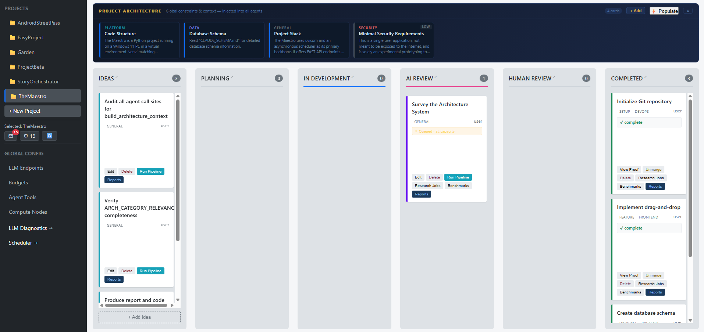
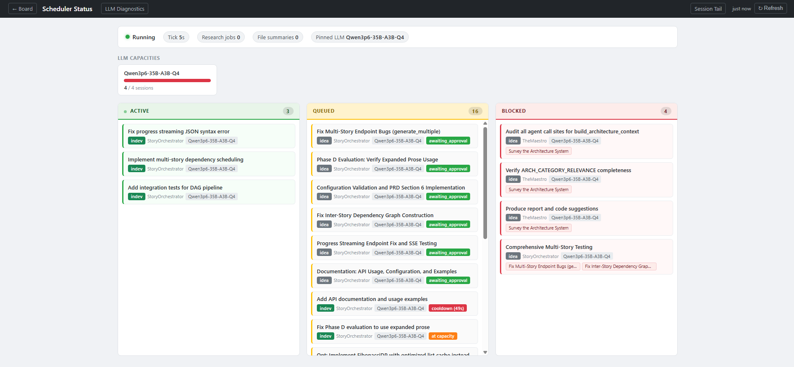
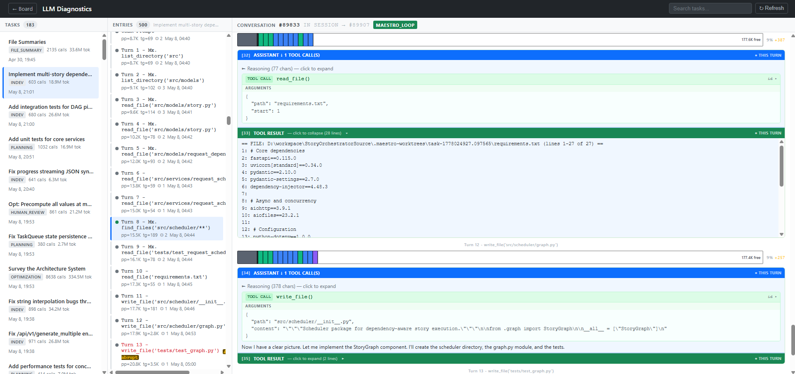
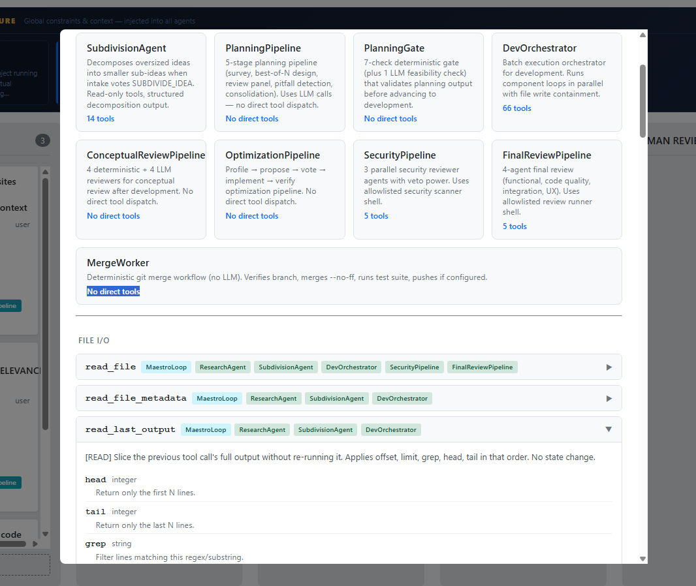
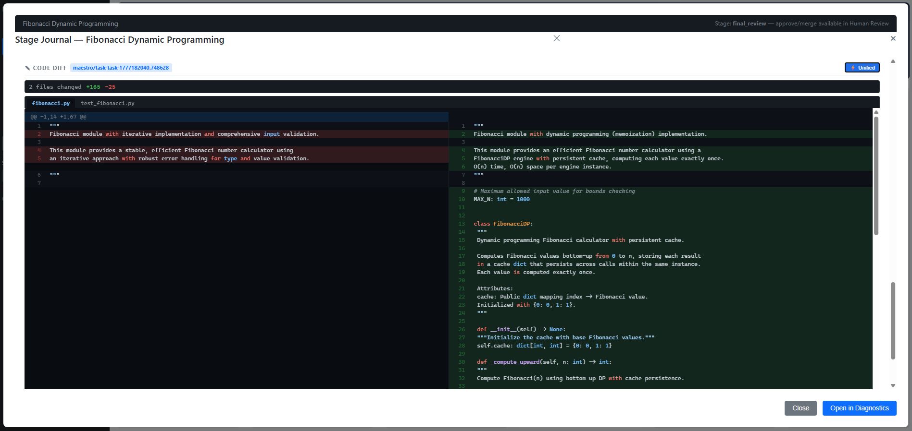
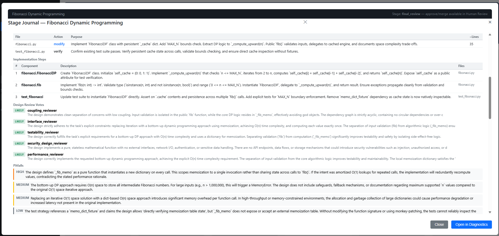

# TheMaestro — Agentic Software Factory

> **An agentic LLM orchestration system for automated software project management.**
> A Kanban board whose cards are executed by LLMs, not tracked by humans.

[](https://fastapi.tiangolo.com/)
[](https://www.sqlite.org/)
[](https://www.python.org/)

---

> [!WARNING]
> ## This project is not complete
>
> **TheMaestro is an idea in progress — it is not fit for use.**
>
> - The system is unfinished. Large parts are missing, broken, or untested.
> - Do not use this in production or as a dependency.
> - If this concept interests you, **contributors are very welcome.**
>   Open an issue, fork the repo, or reach out — the more hands the better.

---

## Showcase

### Kanban Board
The main interface. An architecture constraint bar spans the top; task cards flow through nine automated pipeline stages below. Projects switch instantly via the sidebar.



---

### Live Task Tracking
The scheduler status view shows every active, queued, and blocked task in real time — with LLM endpoint assignment, token budgets, and session state at a glance.



---

### LLM Diagnostics Viewer
Full conversation replay for every LLM call — turn-by-turn context bars, tool call trees, token deltas, and cost breakdowns across all agent sessions.



---

### Agent & Tool Catalogue
Every agent type and its permitted tool set is visible in the UI — from SubdivisionAgent and PlanningPipeline through to SecurityPipeline and MergeWorker.



---

### Split Diff with Syntax Highlighting
The Stage Journal's code diff viewer supports unified and split modes with full syntax highlighting across all changed files on the task branch.



---

### Rich Stage Journal
Per-task audit trail covering planning gate checks, component results, security verdicts, Performance Improvement Plans, and final review votes — all in one scrollable view.



---

## What It Is

TheMaestro takes human intent — expressed as **IDEA cards on a Kanban board** — and drives a fleet of locally-hosted LLMs through a closed-loop pipeline:

```
IDEA → Intake Vote → Planning → Implementation → Review → Accept
```

Each stage is automated, gated, and auditable. A non-engineer with a clear idea and a good GPU can ship production-quality software.

### Core Principles

| Principle | What It Means |
|---|---|
| **Irreversibility prevention** | Every agent action is either reversible (archive, branch) or gated (review panel, intake vote) |
| **Markdown first** | Designs are blueprinted in `.md` files before any source code is generated |
| **Git isolation** | Each task executes in its own worktree — agents cannot touch main or each other |
| **Defense in depth** | Five independent safety layers; failure of one does not compromise the system |
| **Human oversight** | Human merge required; agents propose, humans decide |

---

## Quick Start

```bash
# 1. Activate virtual environment (use forward slashes — backslashes are dropped in bash)
venv/Scripts/activate

# 2. Install dependencies
pip install -r requirements.txt

# 3. Start the server
python -m uvicorn app.main:app --port 8000

# 4. Open the Kanban board
#    http://localhost:8000/kanban.html
```

The server runs on **http://localhost:8000**. The Kanban board is at `/kanban.html`. Interactive API docs at `/docs`.

---

## Architecture

```
┌──────────────────────────────────────────────────────────┐
│                    HUMAN OPERATOR                         │
│          Kanban Board  ·  Stage Journal  ·  Diagnostics   │
└──────────────────────┬───────────────────────────────────┘
                       │  HTTP (FastAPI)
┌──────────────────────▼───────────────────────────────────┐
│                   TheMaestro Server                       │
│  REST API  ·  Scheduler  ·  MCP Server                    │
└──────────────────────┬───────────────────────────────────┘
                       │  agent dispatch
┌──────────────────────▼───────────────────────────────────┐
│                   Agent System                            │
│  MaestroLoop · Planning · Review · Security · Optimization│
└──────────────────────┬───────────────────────────────────┘
                       │  OpenAI-compatible HTTP
┌──────────────────────▼───────────────────────────────────┐
│              Compute Resource Layer                       │
│  Compute Nodes → LLM Endpoints (local or remote)          │
└───────────────────────────────────────────────────────────┘
                       │
┌──────────────────────▼───────────────────────────────────┐
│              SQLite Database (data/kanban.db)             │
└───────────────────────────────────────────────────────────┘
```

See **[ARCHITECTURE.md](ARCHITECTURE.md)** for the full system reference.

---

## The Pipeline

Cards flow through nine stages. Each transition is gated by automated checks and LLM review panels.

| Stage | Agent | Gate | Demotes To |
|---|---|---|---|
| **IDEA** | IntakePipeline | 4-stage LLM vote panel | — |
| **PLANNING** | PlanningPipeline (5 stages) | 7 deterministic + 1 LLM check | IDEA (if scope too large) |
| **INDEV** | DevOrchestrator → MaestroLoop | All components pass + tests green | PLANNING |
| **CONCEPTUAL_REVIEW** | ConceptualReviewPipeline | LLM panel majority | INDEV |
| **OPTIMIZATION** | OptimizationPipeline | LLM pass | INDEV |
| **SECURITY** | SecurityPipeline | Bandit + pip-audit + LLM | INDEV |
| **FINAL_REVIEW** | FinalReviewPipeline | LIKELY/POSSIBLE majority | INDEV |
| **HUMAN_REVIEW** | — | Human accepts & merges | FINAL_REVIEW (if rejected) |
| **COMPLETED** | — | Git merge to main | — |

```
IDEA → PLANNING → INDEV → CONCEPTUAL_REVIEW
                              │              │
                        OPTIMIZATION   SECURITY
                              │              │
                         FINAL_REVIEW → HUMAN_REVIEW → merge → COMPLETED
```

Every demotion writes a **Performance Improvement Plan** (PIP) — hard requirements the agent must satisfy on retry.

---

## Key Features

### Agent System
- **15 agent types** — planning, implementation, review, security, optimization, research, subdivision, PIP resolution, and autonomous project resurrection
- **Turn-based LLM loops** — structured turns with tool use, circuit breakers, and context budget tracking
- **Best-of-N design** — parallel LLM calls with distinct personas (correctness, security, clarity, performance, architecture)
- **Named shell tools** — 18 granular tools (`run_pytest`, `run_bandit`, `git_add`, etc.) replace grouped shell entries

### Scheduler
- **DAG-aware dispatch** — topological sort with prerequisite resolution and cycle detection
- **Three-tier capacity model** — per-LLM, per-node model, per-node session caps enforced at every 5-second tick
- **Auto-rescue** — orphaned jobs reset, hung sessions expired, orphaned worktrees pruned

### Safety
- **Git worktree isolation** — each task gets its own independent checkout on `maestro/task-{id}`
- **No hard deletes** — archive instead of delete everywhere; soft-delete with BFS cascade
- **Loop circuit breakers** — max turns, consecutive error limits, context saturation hard stops

### Observability
- **Stage Journal** — tabbed diff view, fullscreen mode, transition run cards with verdict colors
- **Diagnostics viewer** — agent sessions, budget traces, task activity (split into 5 modular JS files)
- **Column Map View** — full-screen 2D radial canvas showing task hierarchy
- **MCP integration** — 20+ tools for Claude Code (diagnose, monitor, action)

---

## Configuration

**`maestro.ini`** is the master config file with 20+ sections. Key ones:

| Section | Controls |
|---|---|
| `[loop]` | Wiggum Loop safety limits (max turns, consecutive errors) |
| `[intake]` | Pipeline voting, research lives, tiebreaker |
| `[scheduler]` | Tick interval, dispatchable types |
| `[planning]` | Best-of-N designs, judge tokens |
| `[capacity]` | Per-endpoint capacity bounds |
| `[conceptual_review]` | 10-voter panel settings |
| `[security_review]` | 3-agent veto gate |
| `[final_review]` | 4-agent final judgment |
| `[maestro]` | Autonomous resurrection agent |
| `[pip]` | PIP resolution settings |

All sections have sensible defaults. The system runs out-of-the-box with a local Ollama or llama.cpp instance.

---

## API

The REST API covers tasks, projects, LLM endpoints, budgets, scheduler state, and budget traces. Full interactive docs at **http://localhost:8000/docs**.

**Representative endpoints:**

| Method | Endpoint | Description |
|---|---|---|
| GET | `/api/tasks` | All tasks |
| POST | `/api/tasks` | Create task |
| POST | `/api/tasks/{id}/run-planning` | Trigger planning pipeline |
| POST | `/api/tasks/{id}/demote` | Demote task (writes PIP) |
| GET | `/api/agent/tasks/ready` | DAG-ready tasks |
| POST | `/api/agent/run/{id}` | Start agent loop |
| GET | `/api/budget-entries` | Budget spend trace |
| GET | `/api/scheduler/status` | Scheduler state |

---

## MCP Integration

The Maestro exposes **20+ MCP tools** for Claude Code (configured in `.mcp.json`):

| Category | Tools |
|---|---|
| **Diagnostic** | `diagnose_task`, `get_project_health`, `get_capacity_status`, `find_stuck_tasks` |
| **Action** | `trigger_planning_run`, `demote_task`, `stop_agent`, `set_task_type` |
| **Monitor** | `monitor` — blocks N seconds, returns activity diff + pattern flags |

Default monitoring workflow: `/loop` → each iteration calls `monitor()` and returns a structured report with five pattern flags.

---

## Testing

```bash
python -m pytest app/tests/ -v
```

**~700 tests** across 44 files covering pipeline, agents, scheduler, DAG resolution, tool safety, LLM client resilience, subdivision, and PIP resolution.

---

## Troubleshooting

| Problem | Fix |
|---|---|
| Port in use | `python -m uvicorn app.main:app --port 8002` |
| Import errors | `venv/Scripts/activate && pip install -r requirements.txt` |
| Stuck cards | `mcp__maestro__diagnose_task(task_id)` in Claude Code |
| MCP hangs | Wait a few seconds (SQLite lock contention), or `mcp__maestro__restart_server()` |
| Reset DB | `del data\kanban.db && python -c "from app.database import init_db; init_db()"` |

---

## Documentation

| Document | Purpose |
|---|---|
| [ARCHITECTURE.md](ARCHITECTURE.md) | Full system reference — topology, pipeline, agents, safety, data |
| [PRD.md](PRD.md) | Product roadmap, shipped capabilities, forward themes |
| [CLAUDE.md](CLAUDE.md) | Agent-facing reference — key files, patterns, conventions |
| [CLAUDE_SCHEMA.md](CLAUDE_SCHEMA.md) | Complete database schema reference |

---

*TheMaestro — Humans describe. Machines build.*
